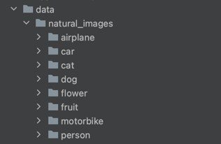

# MLzoomcamp capstone project

## Project parts:

### Problem description

We want to implement an algorithm that will distinct between of 7 classes of images:

    'airplane', 'person', 'flower', 'fruit', 'cat', 'dog', 'car', 'motorbike'

Dataset to be used on [Kaggle](https://www.kaggle.com/datasets/prasunroy/natural-images/data).

I don't want to upload the whole dataset to the github, so when you pull the project from my repository you'll have only 5 images from each class there.
Here are a few examples:

1. [Airplane example](data/natural_images/airplane/airplane_0002.jpg)
2. [Dog example](data/natural_images/dog/dog_0004.jpg)
3. [Person example](data/natural_images/person/person_0003.jpg)

If you want to reproduce the code you'll have to download the whole dataset and swap current data/natural_images folder structure with downloaded data.

## EDA + Model training

It can take up to 30 minutes to run the whole notebook, my models require some time for training.  
Warning: all training scripts can take really long time if you don't have GPU.

The whole EDA process fully described in the [Jupyter notebook](notebook.ipynb).

In a few words:

**Data analysis**

* During the EDA we look at images of different classes
* Compare classes sizes (they are similarly sized)
* And look at images sizes (they have different sizes, so we change image sizes before model training)

**Splitting the data**

We split the data into train, validation and test in proportions 60/20/20

**Model training**

We train 3 different models:

1. Retrain top (dense) layers of Xception
2. Custom CNN
3. Retrain top (dense) layers of VGG16

**Note:** Retraining top (dense) layers was used in lecture 8 of the course. 

We also fine tuned model hyperparameters in order to improve model performance.
Hyperparameters we used:
1. Learning rate
2. Dropout
3. Layers structure 
   1. Inner layer sizes for top (dense) layers of Xception and VGG16
   2. Structure of our custom CNN

Final results of the models on validation test after fine tuning:

1. Xception with fine tuning - 82.6%
2. Custom sequential model - 85.4%
3. VGG16 - 98%

## Exporting notebook to the script

* The whole training process can be reproduced using [train.py](train.py) file.  
* This file has all the same operations we did in the notebook with the initial dataset and then trains VGG16 model on preprocessed data.  
* Ready model is saved in [final_model.tflite](final_model.tflite) file (because afterall we only need it for inference)

## Reproducibility

Link to the dataset: [Dataset on Kaggle](https://www.kaggle.com/datasets/prasunroy/natural-images/data).

Download it and unzip it.

Expected files structure:  

Install requirements:

    pip3 -r requirments.txt 

Then you can run the notebook or training script

## Model deployment

My model is deployed via FastApi. You can run it using the following command on port 8000:

    uvicorn image_sorting_service:app --reload --port 8000 --host 0.0.0.0

You can open swagger of this service here:

    0.0.0.0:8000/image_sorting_service/api/docs

### This service has two endpoints:

**Service health endpoint**

      GET 0.0.0.0:8000/image_sorting_service/api/service_health

This GET endpoint returns a string "Service is up" if service is working

**Image classification endpoint**

      POST 0.0.0.0:8000/image_sorting_service/api/predict_image

This POST endpoint accepts an image and predicts it's class.

## Dependency and environment management

#### Tested on linux server:

I use python 3.10

1. Venv module installation:  

      sudo apt install python3-venv

2. Enter directory with my midterm project:

      
      cd path_to_my_project

2. Create virtual environment:
   

      python3 -m venv testing_environmet

3. Activating virtual environment:

      source testing_environmet/bin/activate

4. Install requirments:

      pip3 install -r requirements.txt

5. To test the installation you can either:
   1. Run the testing script: 
   
            python3 train.py

   2. Start prediction_service:
   
            uvicorn image_sorting_service:app --reload --port 8000 --host 0.0.0.0

   
## Containerization

In order to build and run prediction service in Docker container on port 8000:
    
    docker build . -t image_sorting_service
    docker run -d -p 8000:8000 image_sorting_service

The service gonna be accessible from here:
   
      localhost:8000/image_sorting_service/api/docs

## Cloud deployment 

I deployed this service to the ec2 instance for testing, but I shut it down already, so it won't be accessible during peer review. 
But here is the video of how I did it and how I tested it: https://youtu.be/yBEtLkLQjak